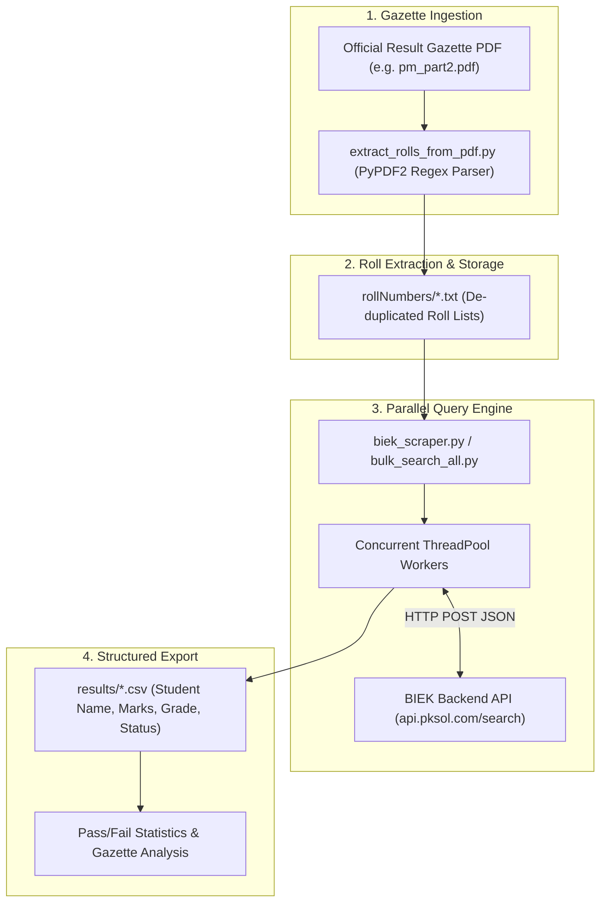

# BIEK Results Search & PDF Gazette Tools

> **Automated data pipeline, PDF result gazette parser, and high-throughput bulk verification suite for Karachi Intermediate Board (BIEK) examinations (HSC Part I & Part II).**

---

> **Created & Maintained by [Abdullah Qureshi](https://abdullah-qureshi.vercel.app)**  
> 🌐 **Portfolio**: [abdullah-qureshi.vercel.app](https://abdullah-qureshi.vercel.app) • 💼 **LinkedIn**: [abdullahqureshi27](https://www.linkedin.com/in/abdullahqureshi27) • 🐙 **GitHub**: [@abdullahqureshi27](https://github.com/abdullahqureshi27)

---

[](https://python.org)
[](https://docs.astral.sh/uv/)
[](https://pypdf2.readthedocs.io/)
[](https://requests.readthedocs.io/)
[](https://github.com/abdullahqureshi27/biek-results-search)

---

## 🌟 Key Features

- 🔍 **Live BIEK Online Result Lookup**: Search student marks, parentage, total scores, grades, and pass/fail statuses across any roll number.
- 📄 **Official Gazette PDF Parser**: High-accuracy regex and token-based parser extracting thousands of student roll numbers and marks directly from official scanned/digitized BIEK PDF gazettes.
- ⚡ **Asynchronous & Threaded Worker Pool**: Process thousands of candidate roll numbers in parallel with configurable batching, request throttling, and exponential backoff to prevent rate limits.
- 🏫 **Comprehensive Faculty Support**: Out-of-the-box support for Science Pre-Medical (`sm`), Science Pre-Engineering (`se`), Science General (`sg`), Commerce (`c`), and Humanities (`a`).
- 📊 **CSV & Structured Data Export**: Real-time streaming of retrieved result records into CSV files with automatic deduplication.

---

## 🏗️ Architecture & Data Pipeline



---

## 🛠️ Technology Stack

| Domain | Technology / Library | Purpose |
|---|---|---|
| **Runtime** | [Python 3.12+](https://python.org) | Core scripting environment |
| **Package Management** | [uv](https://docs.astral.sh/uv/) | Fast Python dependency management and execution |
| **PDF Extraction** | [PyPDF2](https://pypdf2.readthedocs.io/) | Parsing binary PDF text streams and gazette grids |
| **Networking** | [Requests](https://requests.readthedocs.io/) | HTTP client with connection pooling and sessions |
| **Concurrency** | `concurrent.futures` / ThreadPoolExecutor | Multi-worker parallel querying |

---

## 📂 Project Structure

```text
biek-results-search/
├── scripts/
│   ├── biek_scraper.py            # Sequential & batch lookup with CSV export
│   ├── bulk_search_all.py         # Multi-worker parallel search pipeline
│   └── extract_rolls_from_pdf.py  # Regex parser for official gazette PDFs
├── pdfs/                          # Raw result gazette PDF archives
├── rollNumbers/                   # Extracted clean roll lists (one per line)
├── results/                       # Generated CSV outcome datasets
├── pyproject.toml                 # Project metadata and dependencies
└── PROGRESS.md                    # Research notes and historical API findings
```

---

## 🚀 Local Quickstart Guide

### Prerequisites
- [uv](https://docs.astral.sh/uv/) or Python 3.12+ installed.

### 1. Clone & Install
```bash
git clone https://github.com/abdullahqureshi27/biek-results-search.git
cd biek-results-search

# Install dependencies using uv
uv sync
```

### 2. Extract Roll Numbers from a Result Gazette PDF
```bash
uv run python scripts/extract_rolls_from_pdf.py pdfs/pm_part2.pdf rollNumbers/pm_rolls.txt
```

### 3. Query Results
```bash
# Query specific rolls:
uv run python scripts/biek_scraper.py --roll-numbers 439581 439582 --faculty sm --output results/pm_results.csv

# Query from an extracted list:
uv run python scripts/biek_scraper.py --file rollNumbers/pm_rolls.txt --faculty sm --output results/pm_results.csv
```

---

## 🧪 Testing & Verification

Run script sanity checks and verify dependency installation:

```bash
# Verify Python environment
uv run python --version

# Verify scripts compile without syntax errors
uv run python -m py_compile scripts/biek_scraper.py scripts/extract_rolls_from_pdf.py
```

---

## 👨‍💻 Author & Connect

**Abdullah Qureshi**  
*Full-Stack & AI Systems Engineer*

- 🌐 **Portfolio**: [https://abdullah-qureshi.vercel.app](https://abdullah-qureshi.vercel.app)
- 💼 **LinkedIn**: [https://www.linkedin.com/in/abdullahqureshi27](https://www.linkedin.com/in/abdullahqureshi27)
- 🐙 **GitHub**: [https://github.com/abdullahqureshi27](https://github.com/abdullahqureshi27)
- ✉️ **Contact**: [mabdullahqureshi583@gmail.com](mailto:mabdullahqureshi583@gmail.com)
